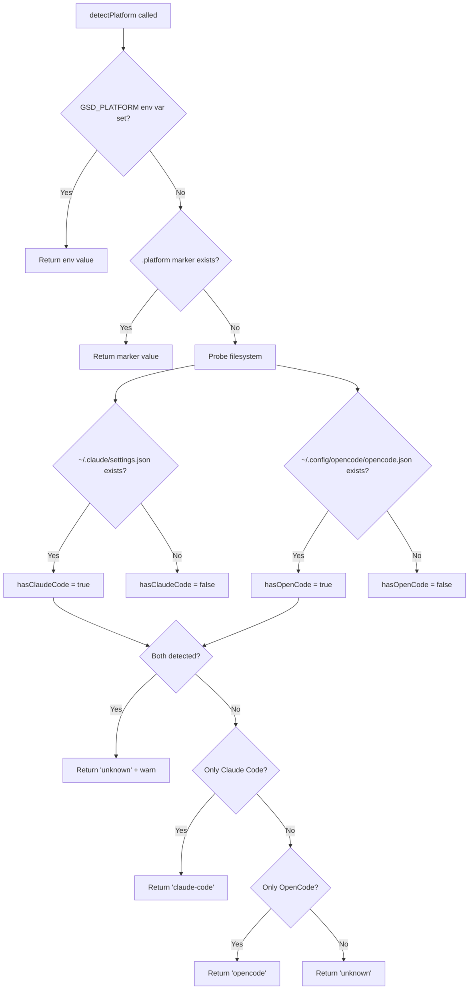
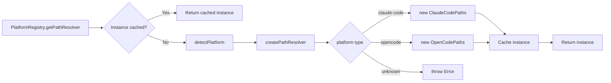
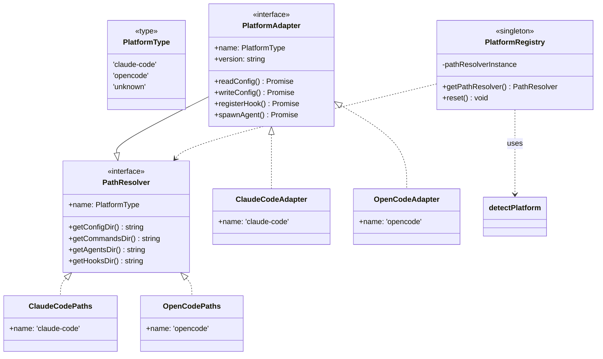

<objective>
Create the platform architecture documentation explaining the adapter pattern, detection flow, registry, and design rationale.

Purpose: Enable contributors to understand the platform abstraction design so they can reason about component relationships and extend the system.

Output: `docs/platform/ARCHITECTURE.md` — comprehensive architecture doc with Mermaid diagrams
</objective>

<execution_context>
@~/.config/opencode/get-shit-done/workflows/execute-plan.md
@~/.config/opencode/get-shit-done/templates/summary.md
</execution_context>

<context>
@.planning/PROJECT.md
@.planning/ROADMAP.md
@.planning/STATE.md
@.planning/phases/07-architecture-documentation/07-CONTEXT.md

Source code to document:
@src/platform/types.ts (PlatformType definition)
@src/platform/detection.ts (runtime detection with priority resolution)
@src/platform/registry.ts (singleton factory pattern)
@src/platform/adapter.ts (interface contract with behavioral requirements)
@src/platform/paths.ts (path resolution abstraction)
@src/platform/index.ts (public exports)
@src/platform/adapters/claude-code.ts (Claude Code implementation)
@src/platform/adapters/opencode.ts (OpenCode implementation)
</context>

<tasks>

<task type="auto">
  <name>Task 1: Create docs/platform directory and ARCHITECTURE.md</name>
  <files>docs/platform/ARCHITECTURE.md</files>
  <action>
Create `docs/platform/ARCHITECTURE.md` with the following structure:

**Document structure:**

```markdown
# Platform Abstraction Architecture

## Overview
- What problem this solves (GSD works on multiple AI platforms)
- High-level component summary (types, detection, registry, adapter, paths)

## Core Concepts

### Platform Type
- Source: `src/platform/types.ts`
- The `PlatformType` union type ('claude-code' | 'opencode' | 'unknown')
- Why it's a union type, not an enum

### Adapter Pattern
- Why adapter pattern over conditionals scattered through codebase
- Why adapter pattern over inheritance hierarchy
- The `PlatformAdapter` interface as the contract
- How both Claude Code and OpenCode satisfy the same interface

## Architecture Components

### Detection (`src/platform/detection.ts`)
- Priority-based platform detection
- 1. Environment variable override (GSD_PLATFORM)
- 2. Marker file (.platform) from installation
- 3. Filesystem probing (settings.json vs opencode.json)
- 4. Ambiguity handling (both detected → unknown)

### Registry (`src/platform/registry.ts`)
- Factory + Singleton pattern
- Why singleton (avoid repeated filesystem probing)
- Why factory (creates platform-specific instances)
- Anti-pattern warning (don't expand to service locator)

### Path Resolution (`src/platform/paths.ts`)
- The PathResolver interface
- Platform-specific path implementations
- Environment variable support (CLAUDE_CONFIG_DIR, OPENCODE_CONFIG, XDG_CONFIG_HOME)

### Platform Adapter (`src/platform/adapter.ts`)
- Full interface contract
- Method categories: path resolution, config, agent spawning, hooks, commands, capabilities
- Behavioral contract specification (10 binding requirements)

## Data Flow Diagrams

Include Mermaid diagrams (see Task 2 for details):
1. Platform Detection Flow
2. Adapter Resolution Flow
3. Component Relationships

## Design Rationale

### Why Adapter Pattern?
- Problem: Conditionals like `if (platform === 'claude-code')` scattered everywhere
- Solution: Encapsulate ALL platform differences in adapter implementations
- Benefit: Core GSD code is platform-agnostic

### Why Runtime Detection?
- Problem: Can't know platform at build time
- Solution: Detect at runtime, cache result
- Benefit: Same code runs on any platform

### Alternatives Considered
1. Conditional branches (rejected: scattered platform knowledge)
2. Inheritance hierarchy (rejected: rigid, doesn't compose well)
3. Build-time detection (rejected: can't support both platforms in one build)
4. Plugin architecture (deferred: complexity not needed for 2 platforms)

## File Reference

| File | Purpose | Key Exports |
|------|---------|-------------|
| types.ts | Type definitions | PlatformType |
| detection.ts | Runtime detection | detectPlatform() |
| registry.ts | Singleton factory | PlatformRegistry |
| adapter.ts | Interface contract | PlatformAdapter, AgentInstance, HookType |
| paths.ts | Path resolution | PathResolver, ClaudeCodePaths, OpenCodePaths |
| adapters/claude-code.ts | Claude Code impl | ClaudeCodeAdapter |
| adapters/opencode.ts | OpenCode impl | OpenCodeAdapter |
```

**Target audience (from CONTEXT.md):**
- Human developers wanting to add new platform adapters
- LLMs researching the codebase

**Implied requirements:**
- Clear headings and structure (LLM-parseable)
- Concrete code references with file paths
- Mermaid diagrams that render on GitHub
- Explanation of WHY decisions were made
- Top-down flow (concept → component → code)
  </action>
  <verify>File exists at docs/platform/ARCHITECTURE.md with all required sections</verify>
  <done>ARCHITECTURE.md created with Overview, Core Concepts, Architecture Components, Data Flow Diagrams, Design Rationale, and File Reference sections</done>
</task>

<task type="auto">
  <name>Task 2: Add Mermaid diagrams for visual learners</name>
  <files>docs/platform/ARCHITECTURE.md</files>
  <action>
Add three Mermaid diagrams to ARCHITECTURE.md in the Data Flow Diagrams section:

**Diagram 1: Platform Detection Flow**


**Diagram 2: Adapter Resolution Flow**


**Diagram 3: Component Relationships**


Ensure diagrams:
- Use GitHub-compatible Mermaid syntax
- Have descriptive node labels
- Show data flow direction clearly
  </action>
  <verify>Open docs/platform/ARCHITECTURE.md in GitHub preview or run a Mermaid validator to confirm diagrams render</verify>
  <done>Three Mermaid diagrams added showing detection flow, adapter resolution, and component relationships</done>
</task>

<task type="auto">
  <name>Task 3: Add behavioral contract section with all 10 requirements</name>
  <files>docs/platform/ARCHITECTURE.md</files>
  <action>
Add a "Behavioral Contracts" section to ARCHITECTURE.md that extracts and explains the 10 binding requirements from `src/platform/adapter.ts` lines 309-360:

```markdown
## Behavioral Contracts

These requirements MUST be satisfied by all platform adapter implementations:

### 1. Absolute Paths
Path resolution methods MUST return absolute paths (never relative).
- Rationale: Prevents CWD-dependent bugs
- Test: `resolver.getConfigDir().startsWith('/')`

### 2. Preserve Settings
Config methods MUST preserve existing settings when merging.
- Rationale: Prevents data loss when GSD modifies only specific settings
- Test: Write config A, merge config B, verify A still present

### 3. Parallel Agents
Agent spawning MUST support parallel execution.
- Rationale: Critical for multi-agent workflows
- Test: Spawn 2 agents simultaneously, both complete successfully

### 4. Immediate Failure Detection
Agent spawning MUST detect spawn failures immediately.
- Rationale: Silent failures are unacceptable
- Test: Spawn non-existent agent, error thrown within 1 second

### 5. Idempotent Hooks
Hook registration MUST be idempotent.
- Rationale: Prevents duplicate hooks from multiple installations
- Test: Register same hook twice, only one entry exists

### 6. Command Collision Detection
Command registration MUST detect name collisions.
- Rationale: Prevents overwriting user's custom commands
- Test: Register existing command name, error thrown

### 7. Clear Errors
All methods MUST throw clear errors (no silent failures).
- Rationale: Debuggability and user-friendly messages
- Test: Invalid input produces descriptive error message

### 8. No Planning File Modifications
Platform adapters MUST NOT modify .planning/ files.
- Rationale: Planning files are platform-agnostic project state
- Test: Adapter operations don't touch .planning/

### 9. Runtime Detection
Platform detection MUST happen at runtime (never compile-time).
- Rationale: Enables portable .planning/ directories
- Test: Same binary detects different platforms based on environment

### 10. Backup Before Modify
Configuration changes MUST backup before modifying.
- Rationale: Enables safe rollback on failures
- Test: Config modification creates .bak file first
```

Reference the source: "See `src/platform/adapter.ts` lines 309-360 for the complete specification."
  </action>
  <verify>Behavioral Contracts section exists with all 10 numbered requirements and rationales</verify>
  <done>Behavioral Contracts section added with all 10 binding requirements, rationales, and test suggestions</done>
</task>

</tasks>

<verification>
- [ ] docs/platform/ARCHITECTURE.md exists
- [ ] Document has all major sections (Overview, Core Concepts, Components, Diagrams, Rationale, Contracts)
- [ ] Mermaid diagrams use valid GitHub-compatible syntax
- [ ] All 10 behavioral contracts documented with rationales
- [ ] File references point to actual source files
- [ ] Document is parseable by LLMs (clear headings, consistent structure)
</verification>

<success_criteria>
ARCH-01 satisfied: Design pattern explanation covers adapter pattern, registry, detection flow
ARCH-02 satisfied: 3 Mermaid diagrams visualize component relationships and data flow
ARCH-03 satisfied: Design rationale section explains trade-offs and alternatives considered

Phase 7 success criteria:
1. ✓ Reader can explain adapter pattern and why chosen (Core Concepts + Design Rationale sections)
2. ✓ Reader can trace detection → registry → adapter flow (Architecture Components + Diagrams)
3. ✓ Mermaid diagrams render on GitHub (standard Mermaid syntax used)
4. ✓ Design rationale explains trade-offs (Why Adapter Pattern, Alternatives Considered sections)
</success_criteria>

<output>
After completion, create `.planning/phases/07-architecture-documentation/07-01-SUMMARY.md`
</output>
