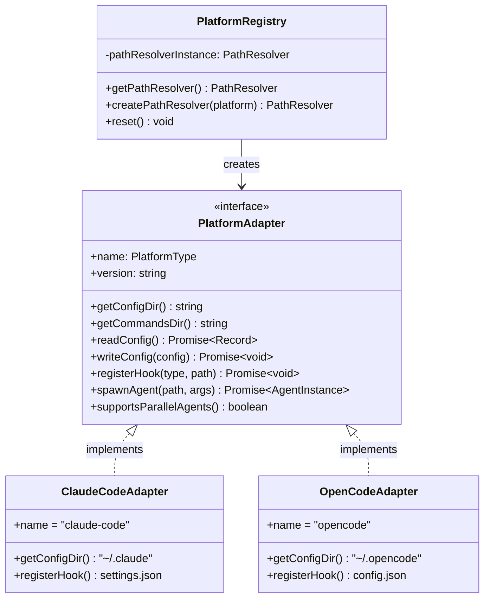
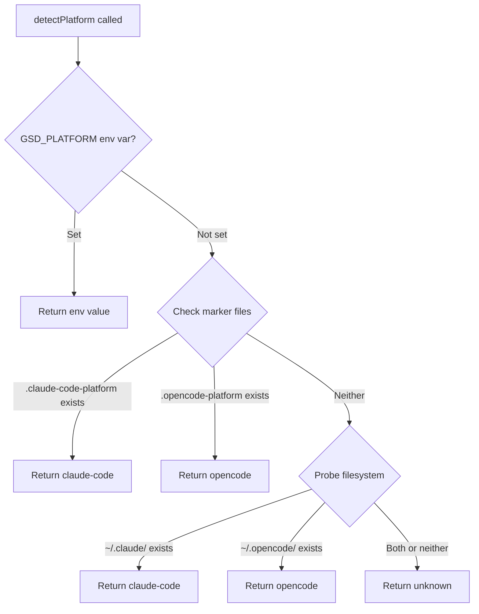

# Stack Research: Platform Documentation

**Project:** GSD Platform Abstraction Documentation
**Researched:** 2026-01-22
**Domain:** Technical documentation for TypeScript platform abstraction system
**Target Audience:** Contributors adding new platform adapters
**Overall Confidence:** HIGH

## Recommendation

**Use plain Markdown with Mermaid diagrams. No doc generator.**

This is a focused contributor guide (not API reference docs), the codebase is small (1,724 LOC, 12 files), and you already have `docs/` with working Markdown. Adding TypeDoc or a doc site generator adds build complexity without proportional value.

### Why Plain Markdown Wins

| Factor | Plain Markdown | Doc Generator (TypeDoc, VitePress) |
|--------|----------------|-----------------------------------|
| **Setup cost** | Zero | 30-60 min + config debugging |
| **Maintenance** | Edit .md files | Keep build pipeline working |
| **GitHub rendering** | Works natively | Requires deploy step |
| **Diagram support** | Mermaid renders in GitHub | Same |
| **Contributor friction** | Clone + edit | Clone + understand build |
| **Solo maintainer fit** | Excellent | Overkill |

**The decisive factor:** Your docs explain *how to create an adapter* (architectural guidance), not *what methods exist* (API reference). TypeDoc generates API reference. You need prose with diagrams.

## Documentation Format

### Decision: Plain Markdown

Keep docs in `docs/` directory (you already have `docs/PLATFORM-SUPPORT.md`).

**Recommended structure:**
```
docs/
├── PLATFORM-SUPPORT.md      # (existing) User-facing platform compatibility
├── architecture/
│   ├── OVERVIEW.md          # System architecture with diagrams
│   ├── ADAPTER-PATTERN.md   # Deep dive on adapter pattern
│   └── REGISTRY.md          # Factory + singleton explanation
├── guides/
│   ├── CREATING-ADAPTER.md  # Step-by-step adapter tutorial
│   └── TESTING-ADAPTER.md   # How to test new adapters
└── reference/
    └── INTERFACE.md         # PlatformAdapter interface contract
```

**Why this structure:**
1. `architecture/` - Explains the "why" (for understanding)
2. `guides/` - Explains the "how" (for doing)
3. `reference/` - Explains the "what" (for looking up)

Contributors read `OVERVIEW.md` first, then `CREATING-ADAPTER.md` when implementing.

### What About TypeDoc?

**Don't use it for this milestone.** Here's why:

TypeDoc excels when:
- Large API surface (100+ exported functions)
- Library consumed by external developers
- Need auto-generated parameter types

GSD's situation:
- Small API surface (1 interface, ~15 methods)
- Internal contributors (not library consumers)
- Methods already have JSDoc in source code

**The interface is already documented in `src/platform/adapter.ts` with 360 lines of comments.** TypeDoc would duplicate this in a less navigable format. Your contributors will read the source file anyway.

If you later want TypeDoc, add it then. Right now it's overhead.

## Diagrams

### Decision: Mermaid (Embedded in Markdown)

Mermaid diagrams render natively in GitHub Markdown. No build step, no separate image files.

**Perfect for your use case:**
- Class diagrams for adapter pattern (`<<interface>>` annotation)
- Flowcharts for detection logic
- Sequence diagrams for installation flow

### Example: Adapter Pattern Diagram

This renders directly in GitHub:

```markdown

```

### Example: Detection Flow Diagram

```markdown

```

### Mermaid Quick Reference for This Project

| Diagram Type | Use For |
|--------------|---------|
| `classDiagram` | Adapter interface + implementations |
| `flowchart` | Detection logic, installation flow |
| `sequenceDiagram` | Hook registration, agent spawning |

**Class diagram annotations to use:**
- `<<interface>>` for PlatformAdapter
- `<|..` for "implements" relationship
- `-->` for "uses" relationship

**Confidence:** HIGH - Mermaid syntax verified against official docs (2026-01-22).

## What NOT to Use

### Don't Use: VitePress / Docusaurus / GitBook

**Why:** You don't need a documentation website. GSD's docs live in the repo, viewed on GitHub. A doc site adds:
- Build pipeline (Node.js + Vite/React)
- Deployment (GitHub Pages, Vercel, Netlify)
- Version syncing (docs vs code drift)
- One more thing to break

When to reconsider: If GSD gets 1000+ GitHub stars and needs a marketing site with docs.

### Don't Use: TypeDoc

**Why (for this milestone):**
1. Your interface is 1 file (adapter.ts) with extensive JSDoc already
2. TypeDoc output is navigable but adds 50+ HTML files for 12 source files
3. Contributors need *understanding*, not *method lookup*
4. You'd still need to write the architecture/guides docs anyway

TypeDoc is great for libraries (React, Lodash). GSD is a tool with internal extension points.

### Don't Use: Separate Image Files for Diagrams

**Why:** Mermaid in Markdown is:
- Version controlled with the docs
- Editable without opening image editor
- Rendered by GitHub natively
- Diffable in PRs

PNG/SVG diagrams get stale because editing them is annoying.

### Don't Use: draw.io / Lucidchart / Excalidraw

**Why:** External tools mean:
- Source files (.drawio) in repo that most editors can't preview
- Export step (edit → export PNG → commit)
- Diagrams drift from reality

Mermaid is "diagrams as code" - same commit updates docs and diagram.

### Don't Use: README.md for Everything

**Why:** Your README is for installation/quick start. Architecture docs in README become a wall of text. Keep README focused:
- What is GSD
- How to install
- Link to docs/ for details

## Tooling Summary

| Need | Solution | Install |
|------|----------|---------|
| Write docs | Markdown in `docs/` | Nothing (already have) |
| Architecture diagrams | Mermaid in Markdown | Nothing (GitHub renders it) |
| API reference | Link to `src/platform/adapter.ts` | Nothing |
| Local preview | VS Code Markdown Preview | Nothing (built-in) |
| Mermaid preview | VS Code extension (optional) | `ext install bierner.markdown-mermaid` |

**Total new dependencies: 0**

## Confidence

**HIGH** - This recommendation is based on:

1. **Verified:** Mermaid syntax from official docs (class diagrams support `<<interface>>`, implements relationships)
2. **Verified:** GitHub Markdown renders Mermaid natively (no plugins needed)
3. **Observed:** Your existing `docs/PLATFORM-SUPPORT.md` uses plain Markdown successfully
4. **Observed:** Source code already has extensive JSDoc (`adapter.ts` is 360 lines of documentation)
5. **Principle:** For contributor docs (how to extend), prose + diagrams beats generated API reference

**Edge case handled:** If you later want auto-generated API docs, TypeDoc can be added without disrupting existing Markdown docs. They coexist.

## Rationale Summary

This is documentation for a **documented codebase** (adapter.ts has behavioral contracts in comments) targeting **contributors** (people reading source code anyway). The right tool is:

- **Plain Markdown** - Zero friction for contributors, native GitHub rendering
- **Mermaid diagrams** - Architecture visualization that stays in sync with code
- **No doc generator** - The "reference" is the source file; the docs explain *when and why* to use it

A solo maintainer doesn't need a build pipeline to deploy a docs site. They need docs that help contributors understand the system quickly, and those docs render in GitHub without any deployment.
