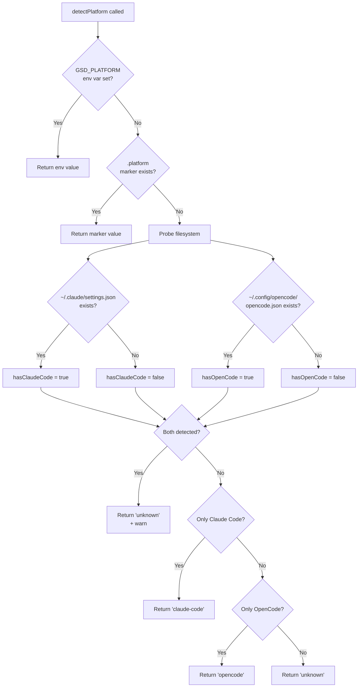
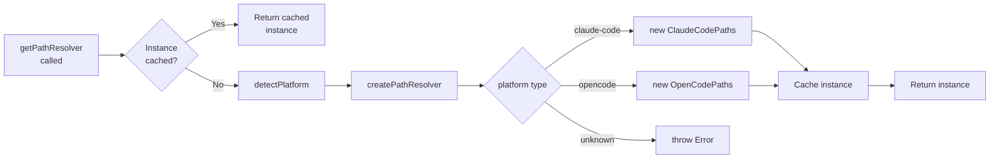
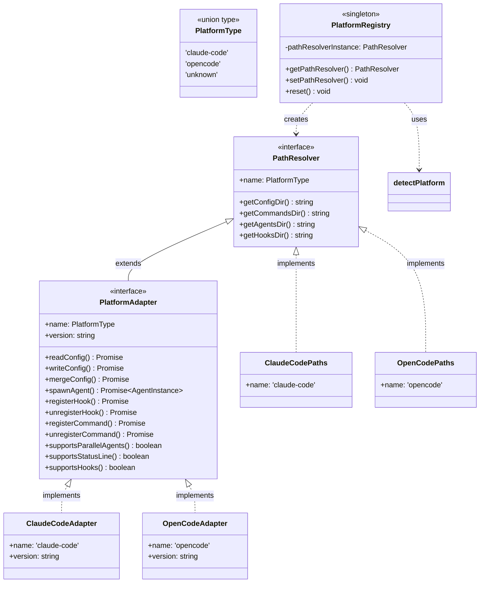

# Platform Abstraction Architecture

GSD's platform abstraction layer enables the same codebase to run seamlessly on multiple AI coding platforms (Claude Code, OpenCode) without conditional logic scattered throughout the application.

## Overview

### Problem Solved

GSD needs to work across multiple AI coding platforms, each with different:
- Configuration file locations (`~/.claude/settings.json` vs `~/.config/opencode/opencode.json`)
- Directory structures for commands, agents, and hooks
- Agent spawning mechanisms (Task tool vs CLI process)
- Configuration formats (JSON vs JSONC)

Without abstraction, the codebase would be littered with platform-specific conditionals:

```typescript
// Anti-pattern: scattered conditionals
if (platform === 'claude-code') {
  configPath = '~/.claude/settings.json';
} else if (platform === 'opencode') {
  configPath = '~/.config/opencode/opencode.json';
}
```

### Solution

Encapsulate ALL platform differences in adapter implementations. Core GSD code calls the adapter interface; the adapter handles platform-specific details.

```typescript
// Correct pattern: platform-agnostic code
const adapter = PlatformRegistry.getAdapter();
const config = await adapter.readConfig();  // Works on any platform
```

### Component Summary

| Component | File | Responsibility |
|-----------|------|----------------|
| **Types** | `src/platform/types.ts` | Platform type definitions |
| **Detection** | `src/platform/detection.ts` | Runtime platform detection |
| **Registry** | `src/platform/registry.ts` | Singleton factory for adapters |
| **PathResolver** | `src/platform/paths.ts` | Platform-specific path resolution |
| **PlatformAdapter** | `src/platform/adapter.ts` | Full platform interface contract |
| **Implementations** | `src/platform/adapters/` | Claude Code and OpenCode adapters |

## Core Concepts

### Platform Type

**Source:** `src/platform/types.ts`

```typescript
export type PlatformType = 'claude-code' | 'opencode' | 'unknown';
```

**Why union type instead of enum?**

1. **Simpler syntax:** `'claude-code'` vs `PlatformType.ClaudeCode`
2. **Better TypeScript inference:** String literals work naturally with switch exhaustiveness
3. **JSON-friendly:** Serializes directly without conversion
4. **Extensible:** Adding a new platform is just adding to the union

The `'unknown'` value handles ambiguous detection (both platforms installed, or neither).

### Adapter Pattern

The **Adapter Pattern** encapsulates platform differences behind a unified interface.

**Why adapter pattern over conditionals scattered through codebase?**

| Scattered Conditionals | Adapter Pattern |
|------------------------|-----------------|
| Platform knowledge in 50+ files | Platform knowledge in 2 files (adapters) |
| Every new feature needs platform checks | New features use interface, no checks |
| Testing requires mocking everywhere | Testing mocks one adapter |
| Adding platform = touching every file | Adding platform = one new adapter |

**Why adapter pattern over inheritance hierarchy?**

| Inheritance | Adapter Pattern |
|-------------|-----------------|
| Rigid parent-child relationships | Flexible composition |
| Diamond problem with multiple inheritance | No inheritance complexity |
| Difficult to mock in tests | Easy to mock via interface |
| Changes to base class ripple everywhere | Changes isolated to adapter |

**The `PlatformAdapter` interface as the contract:**

Both Claude Code and OpenCode adapters implement the same interface:

```typescript
interface PlatformAdapter extends PathResolver {
  readonly name: PlatformType;
  readonly version: string;
  
  // Configuration
  readConfig(): Promise<Record<string, any>>;
  writeConfig(config: Record<string, any>): Promise<void>;
  mergeConfig(updates: Record<string, any>): Promise<void>;
  
  // Agent spawning
  spawnAgent(agentPath: string, args?: Record<string, string>): Promise<AgentInstance>;
  
  // Hooks
  registerHook(hookType: HookType, hookPath: string): Promise<void>;
  unregisterHook(hookType: HookType): Promise<void>;
  
  // Commands
  registerCommand(commandPath: string): Promise<void>;
  unregisterCommand(commandName: string): Promise<void>;
  
  // Capabilities
  supportsParallelAgents(): boolean;
  supportsStatusLine(): boolean;
  supportsHooks(): boolean;
}
```

## Architecture Components

### Detection (`src/platform/detection.ts`)

Runtime platform detection using priority-based resolution:

| Priority | Source | Example |
|----------|--------|---------|
| 1 (highest) | `GSD_PLATFORM` env var | `GSD_PLATFORM=claude-code` |
| 2 | `.platform` marker file | Created by installer |
| 3 | Filesystem probing | Check for config files |
| 4 (lowest) | Ambiguity handling | Both or neither detected |

**Priority 1: Environment Variable Override**

Explicit override for development, testing, or edge cases:

```bash
GSD_PLATFORM=opencode npm run dev
```

**Priority 2: Marker File**

The installer creates `.platform` file at project root with the detected platform. Most reliable for installed projects.

**Priority 3: Filesystem Probing**

Checks for platform-specific configuration files:
- Claude Code: `~/.claude/settings.json`
- OpenCode: `~/.config/opencode/opencode.json`

**Priority 4: Ambiguity Handling**

If BOTH platforms are detected (developer has both installed), returns `'unknown'` with a warning suggesting `GSD_PLATFORM` override.

### Registry (`src/platform/registry.ts`)

**Pattern:** Factory + Singleton

```typescript
class PlatformRegistry {
  private static pathResolverInstance: PathResolver | null = null;
  
  static getPathResolver(): PathResolver {
    if (PlatformRegistry.pathResolverInstance) {
      return PlatformRegistry.pathResolverInstance;  // Cached
    }
    
    const platform = detectPlatform();
    const resolver = PlatformRegistry.createPathResolver(platform);
    PlatformRegistry.pathResolverInstance = resolver;  // Cache
    
    return resolver;
  }
}
```

**Why Singleton?**

Avoid repeated filesystem probing. Platform detection involves file existence checks which are expensive to repeat on every call.

**Why Factory?**

Creates platform-specific instances based on detection result. The factory method encapsulates the `switch(platform)` logic in one place.

**Anti-pattern Warning**

DO NOT expand the registry into a service locator that provides arbitrary services. The registry creates ONE thing: platform adapters. Service locator is an anti-pattern that makes dependencies implicit.

```typescript
// WRONG: Service locator anti-pattern
const logger = Registry.get('logger');
const db = Registry.get('database');

// RIGHT: Explicit dependencies
constructor(logger: Logger, db: Database) { }
```

### Path Resolution (`src/platform/paths.ts`)

**The PathResolver Interface:**

```typescript
interface PathResolver {
  readonly name: PlatformType;
  getConfigDir(): string;
  getCommandsDir(): string;
  getAgentsDir(): string;
  getHooksDir(): string;
}
```

**Platform-Specific Implementations:**

| Method | Claude Code | OpenCode |
|--------|-------------|----------|
| `getConfigDir()` | `~/.claude/` | `~/.config/opencode/` |
| `getCommandsDir()` | `~/.claude/commands/gsd/` | `~/.config/opencode/command/gsd/` |
| `getAgentsDir()` | `~/.claude/agents/` | `~/.config/opencode/agents/` |
| `getHooksDir()` | `~/.claude/hooks/` | `~/.config/opencode/hooks/` |

**Environment Variable Support:**

| Variable | Platform | Purpose |
|----------|----------|---------|
| `CLAUDE_CONFIG_DIR` | Claude Code | Override config directory |
| `OPENCODE_CONFIG` | OpenCode | Override config file path |
| `XDG_CONFIG_HOME` | OpenCode | XDG Base Directory spec |

### Platform Adapter (`src/platform/adapter.ts`)

The full interface contract for platform implementations.

**Method Categories:**

| Category | Methods | Purpose |
|----------|---------|---------|
| **Path Resolution** | `getConfigDir()`, `getCommandsDir()`, `getAgentsDir()`, `getHooksDir()` | Locate platform directories |
| **Configuration** | `readConfig()`, `writeConfig()`, `mergeConfig()` | Manage platform settings |
| **Agent Spawning** | `spawnAgent()` | Execute agents asynchronously |
| **Hooks** | `registerHook()`, `unregisterHook()` | Lifecycle hook management |
| **Commands** | `registerCommand()`, `unregisterCommand()` | Slash command registration |
| **Capabilities** | `supportsParallelAgents()`, `supportsStatusLine()`, `supportsHooks()` | Feature detection |

**Behavioral Contracts:**

See the [Behavioral Contracts](#behavioral-contracts) section for the 10 binding requirements all implementations must satisfy.

## Data Flow Diagrams

### Platform Detection Flow



### Adapter Resolution Flow



### Component Relationships



## Design Rationale

### Why Adapter Pattern?

**Problem:** Platform-specific conditionals scattered throughout the codebase.

```typescript
// This code exists in 10+ files, each checking platform
function getConfigPath() {
  if (platform === 'claude-code') {
    return path.join(os.homedir(), '.claude', 'settings.json');
  } else if (platform === 'opencode') {
    return path.join(os.homedir(), '.config', 'opencode', 'opencode.json');
  }
}
```

**Solution:** Encapsulate ALL platform differences in adapter implementations.

```typescript
// Platform-agnostic code throughout the codebase
const adapter = PlatformRegistry.getAdapter();
const configPath = path.join(adapter.getConfigDir(), 'settings.json');
```

**Benefit:** Core GSD code is 100% platform-agnostic. Adding a new platform requires:
1. Add type to `PlatformType` union
2. Create new adapter implementation
3. Add detection logic
4. Done - no changes to core code

### Why Runtime Detection?

**Problem:** Can't know which platform at build time. GSD ships as a single package used on multiple platforms.

**Solution:** Detect platform at runtime, cache result.

**Benefit:** 
- Same npm package works everywhere
- Same binary detects different platforms based on environment
- `.planning/` directories are portable between platforms

### Alternatives Considered

| Alternative | Status | Reason |
|-------------|--------|--------|
| **Conditional branches** | Rejected | Scattered platform knowledge; every file needs platform checks |
| **Inheritance hierarchy** | Rejected | Rigid; doesn't compose well; diamond problem risk |
| **Build-time detection** | Rejected | Can't support multiple platforms in one build; ruins portability |
| **Plugin architecture** | Deferred | Complexity not justified for 2 platforms; revisit if 3+ platforms needed |

**Plugin Architecture Note:**

A plugin system (dynamic loading, package.json declarations, etc.) would be appropriate if GSD supported 5+ platforms or allowed user-defined platforms. For 2 known platforms, the adapter pattern provides sufficient abstraction without plugin complexity.

## Behavioral Contracts

These requirements MUST be satisfied by all platform adapter implementations. See `src/platform/adapter.ts` lines 309-360 for the complete specification.

### 1. Absolute Paths

Path resolution methods MUST return absolute paths (never relative).

- **Rationale:** Prevents CWD-dependent bugs; enables reliable file operations regardless of working directory
- **Test:** `resolver.getConfigDir().startsWith('/')`

### 2. Preserve Settings

Config methods MUST preserve existing settings when merging.

- **Rationale:** Prevents data loss when GSD modifies only specific settings; user's custom config survives GSD updates
- **Test:** Write config A, merge config B, verify A still present

### 3. Parallel Agents

Agent spawning MUST support parallel execution.

- **Rationale:** Critical for multi-agent workflows where multiple researchers or executors run simultaneously
- **Test:** Spawn 2 agents simultaneously, both complete successfully

### 4. Immediate Failure Detection

Agent spawning MUST detect spawn failures immediately.

- **Rationale:** Silent failures are unacceptable; user must know immediately if agent failed to start
- **Test:** Spawn non-existent agent, error thrown within 1 second

### 5. Idempotent Hooks

Hook registration MUST be idempotent.

- **Rationale:** Prevents duplicate hooks from multiple installations or re-runs
- **Test:** Register same hook twice, only one entry exists

### 6. Command Collision Detection

Command registration MUST detect name collisions.

- **Rationale:** Prevents overwriting user's custom commands with GSD commands
- **Test:** Register existing command name, error thrown

### 7. Clear Errors

All methods MUST throw clear errors (no silent failures).

- **Rationale:** Debuggability and user-friendly messages; errors should explain what went wrong and suggest fixes
- **Test:** Invalid input produces descriptive error message

### 8. No Planning File Modifications

Platform adapters MUST NOT modify `.planning/` files.

- **Rationale:** Planning files are platform-agnostic project state; adapters handle platform config only
- **Test:** Adapter operations don't touch `.planning/`

### 9. Runtime Detection

Platform detection MUST happen at runtime (never compile-time).

- **Rationale:** Enables portable `.planning/` directories; same code runs on any platform
- **Test:** Same binary detects different platforms based on environment

### 10. Backup Before Modify

Configuration changes MUST backup before modifying.

- **Rationale:** Enables safe rollback on failures; user can recover from botched installations
- **Test:** Config modification creates `.bak` file first

## File Reference

| File | Purpose | Key Exports |
|------|---------|-------------|
| `src/platform/types.ts` | Type definitions | `PlatformType` |
| `src/platform/detection.ts` | Runtime detection | `detectPlatform()` |
| `src/platform/registry.ts` | Singleton factory | `PlatformRegistry` |
| `src/platform/adapter.ts` | Interface contract | `PlatformAdapter`, `AgentInstance`, `HookType` |
| `src/platform/paths.ts` | Path resolution | `PathResolver`, `ClaudeCodePaths`, `OpenCodePaths` |
| `src/platform/adapters/claude-code.ts` | Claude Code implementation | `ClaudeCodeAdapter` |
| `src/platform/adapters/opencode.ts` | OpenCode implementation | `OpenCodeAdapter` |
| `src/platform/index.ts` | Public exports | All exports aggregated |

## Adding a New Platform

This document explains the **architecture**. For step-by-step instructions on implementing a new adapter, see:

**[Creating Platform Adapters](CREATING-ADAPTERS.md)** - Tutorial with code examples, checklists, and testing guide.

---

*Architecture documentation for GSD platform abstraction layer*
*Last updated: 2026-01-22*
